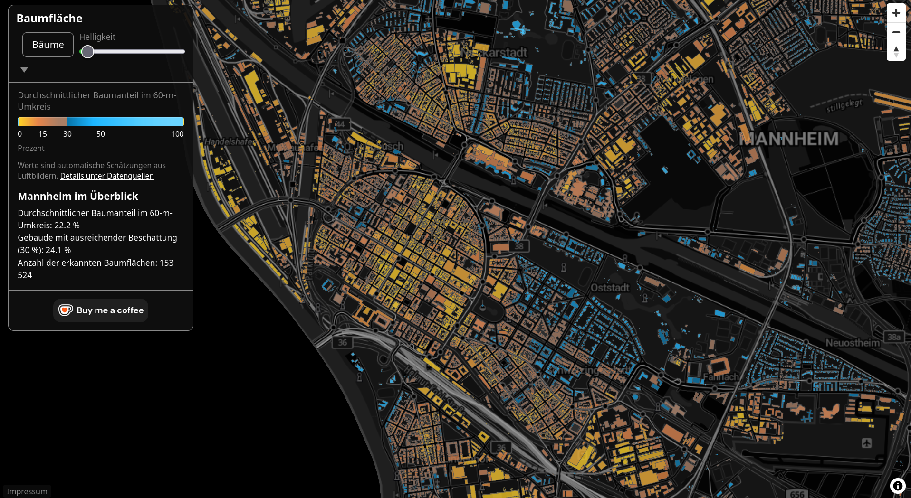

# Mannheim Tree Cover Map (Baumfläche)

A web map of Mannheim where every building is colored by the average
tree cover within 60 meters of it. Dark, quiet, and free to browse.
No account. No tracking. Nothing to install.

## Open the live map

**[https://abu-hamad.de/map/](https://abu-hamad.de/map/)**

## What this map shows

Every building in Mannheim is colored according to how much tree cover
surrounds it. Green buildings sit in leafy surroundings. Red and orange
ones are in areas with little shade. The dark theme makes the colors
stand out, and the map stays readable on phones and large screens.

The map is in German. The color legend labels `0` to `100` percent, and
the `Bäume` button toggles the detected tree layer.

## How to read it

- **Colors**: each building's color is its tree-cover percentage within
  a 60 m radius. The greener the building, the more trees around it.
- **Click a building**: a small popup shows its exact percentage.
- **`Bäume` toggle**: switches the detected tree areas on and off, so
  you can compare the colored buildings with the actual tree canopy.
- **Click a Stadtteil**: every one of the 38 districts opens a popup
  with its building count, average tree cover, and the share below the
  30 % guideline. The building popup also shows which district a
  building belongs to and the district average.
- **City overview**: the "Mannheim im Überblick" card shows the city
  averages: mean tree cover, the share of buildings with sufficient
  shade, and the number of detected tree areas.

## Where the data comes from

The map starts from official aerial imagery (20 cm resolution) and
building data for Mannheim. A computer-vision model detects the tree
canopy in the imagery. Every building then gets the average tree-cover
value of its 60 m surroundings. The result is a static, pre-computed
map. There is no server, no database, and no analytics behind it.

## Credits

This map reproduces the presentation of **CityTreeCover** by Jakob
Schultz, [github.com/jcscaptures/CityTreeCover](https://github.com/jcscaptures/CityTreeCover),
published under the MIT License. The reference copyright and permission
notice are preserved in this repository's [LICENSE](LICENSE).

Map data:

- Buildings and city boundary: LGL — Datenquelle: LGL, www.lgl-bw.de,
  dl-de/by-2-0 (Daten verändert). License text:
  [govdata.de/dl-de/by-2-0](https://www.govdata.de/dl-de/by-2-0).
- Base map: © GeoBasis-DE / BKG (2026) dl-de/by-2-0 —
  [bkg.bund.de](https://www.bkg.bund.de).
- Stadtteile: Stadt Mannheim, GDI-MA, dl-de/by-2-0 (Daten verändert).

## License

This project is published under the [MIT License](LICENSE). The map data
is used under its own terms, see the credits above.

## For developers

The pipeline, deployment, and test setup live in
[DEVELOPMENT.md](DEVELOPMENT.md).
