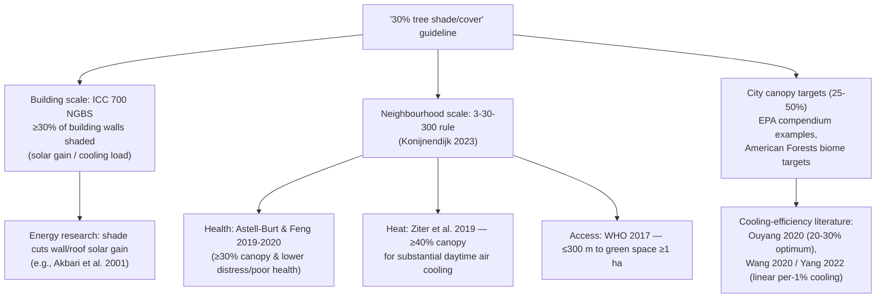

# Why "30% tree shade around buildings"? The evidence behind the 30% canopy/coverage figures for heat protection

**Literature review · 2026-08-06 · slug: `tree-canopy-30-heat`**
**Scope:** scientific evidence for the guideline that roughly 30% of a building's surroundings should be shaded (or covered) by trees for heat protection — covering the origin of the figure, urban tree canopy cover thresholds, the 3-30-300 rule, street-tree shade and cooling studies, and canopy-cover vs heat-stress relationships.

---

## Bottom line

- The "~30%" figure circulating in planning, building codes, and policy is **not one guideline but (at least) two distinct lineages**, each with a different evidence base:
  1. **Building level** — the US National Green Building Standard (ICC 700) offers a landscaping credit requiring **planting that shades ≥30% of building walls** on the summer solstice — a solar-gain/energy standard (ICC/NAHB 2020).
  2. **Neighbourhood level** — the **3-30-300 rule** (Konijnendijk 2023) proposes **≥30% tree canopy in every neighbourhood**, an equity/health benchmark whose 30% figure rests mainly on **health-epidemiology evidence** (Astell-Burt & Feng 2019) — not primarily on heat physics.
- The **heat literature does not establish 30% as a universal physical optimum**. Reported thresholds/optima span **~20–45%** depending on climate, urban form, and metric: ~40% for substantial daytime air-temperature cooling in one influential US study (Ziter et al. 2019), 20–30% as the efficiency optimum in subtropical modelling (Ouyang et al. 2020), 25–45% depending on building height in Nanjing (Li et al. 2023), and **linear (threshold-free)** cooling in several other studies (Ettinger et al. 2024; Yang et al. 2022).
- For **human thermal comfort, shade quality matters more than canopy percentage**: street-tree shade lowers heat-stress indices (PET/UTCI) far more than it lowers air temperature, and canopy density (LAI/PAI) — not cover % — drives the benefit.
- The strongest health-linked use of "30%" is **Iungman et al. 2023 (Lancet)**: modeling showed that raising tree cover to **30%** in 93 European cities would cool cities by a mean 0.4 °C and prevent ≈2,600 (≈39%) of summer UHI-attributable deaths — but this treats 30% as an **intervention target**, not a derived threshold.
- **Caveats are substantial**: thresholds are context-dependent and nonlinear; canopy % (2D) ≠ shade (3D); surface temperature overstates air-temperature effects ~2× (up to ~6× by day in multi-city analyses); trees do little for nighttime heat; trees need water and decades to grow; and 30% is widely unmet in real cities (only ~2 of 8 studied global cities pass it).

---

## 1. Where the 30% figure comes from

### 1a. Building scale: the National Green Building Standard (ICC 700)

The closest match to the phrase "around 30 percent of the surroundings of a building should be shaded by trees" is a **building-code requirement**, not a climate study. The US National Green Building Standard (ICC 700-2020, developed with NAHB) requires, as a landscaping credit:

> "Summer shading by planting installed to shade a minimum of 30% of building walls. To conform to summer shading, the effective shade coverage (five years after planting) is the arithmetic mean of the shade coverage calculated at 10 am for eastward facing walls, noon for southward facing walls, and 3 pm for westward facing walls on the summer solstice." (ICC 700-2020.)

This is an **energy-oriented** rule: shading east/south/west walls cuts solar gain and cooling loads. The underlying evidence is the building-energy literature: Akbari, Pomerantz & Taha (2001) estimated that heat-island mitigation combining cool surfaces and trees could reduce US air-conditioning energy use by ~20%, and building-level studies cited in the EPA compendium report shade-tree cooling savings of roughly 7–47% depending on climate and building. Note that this is a **performance/credit standard**, not a finding that 30% is the biologically or thermally optimal amount of shade; the value appears to be a pragmatic threshold for measurably reducing wall solar gain.

### 1b. Neighbourhood scale: the 3-30-300 rule

The better-known lineage is the **3-30-300 rule** proposed by urban forester Cecil Konijnendijk (first floated 2021; peer-reviewed in *Journal of Forestry Research*, 2023): every home/school/workplace should (a) see ≥3 well-established trees, (b) sit in a neighbourhood with **≥30% tree canopy**, and (c) be ≤300 m from a public green space. The rule has been promoted by the IUCN; Konijnendijk cites cities already targeting ~30% canopy (Barcelona, Bristol, Canberra, Seattle, Vancouver), and German press coverage names Malmö, Utrecht and, in Germany, Essen and Munich among municipalities drawing on the rule in their climate strategies (per promotional press coverage; not stated in the peer-reviewed rule paper).

Crucially, Konijnendijk's own paper shows the **30% is not primarily a heat number**:

- The 30% canopy figure is justified mainly by **health studies**: "Astell-Burt and Feng (2019a, b, 2020) found that higher canopy cover improved sleep patterns and mental health as well as overall health. **A canopy cover of at least 30% for all these aspects resulted in higher health benefits.**"
- For **heat**, Konijnendijk cites Ziter et al. (2019) — which found cooling requires **≥40%** canopy, not 30%: "Ziter et al. (2019) found that local tree canopy should be at least 40% before substantial cooling effects are noted."
- The 300 m component follows WHO Europe's guidance (≤300 m to a green space of ≥1 ha).
- Konijnendijk explicitly positions 30% as a **minimum benchmark** ("cities should strive for even higher canopy percentage when possible"), notes that in arid climates the target should be "30% vegetation — but always with a strong tree component," and cites cities that already target ~30% (Barcelona, Bristol, Canberra, Seattle, Vancouver). He also records that American Forests **withdrew** its older universal 40% recommendation after concluding that a single canopy target is not supported by research across diverse cities.

### 1c. City canopy targets and professional guidelines

Beyond the two lineages above, many canopy targets in the 25–50% range exist, with no single evidence anchor:

- The US EPA Heat Island Compendium does **not** recommend a universal canopy percentage; it documents community-set goals such as Annapolis (MD)'s 50% canopy target (by 2036) and notes that most communities set their own values based on local tree-canopy assessments.
- American Forests historically recommended **40%** urban canopy (1997) but formally withdrew the universal goal in 2017, noting research no longer supports one number; its Tree Equity Score methodology uses **biome-based baselines** — 40% in forested regions, 20% in grassland, 15% in desert, based on USDA Forest Service analyses — adjusted for population density.
- The EU Biodiversity Strategy 2030 calls for "significant" urban tree planting without a percentage; the EU Nature Restoration Law (Regulation (EU) 2024/1991) requires cities to achieve **no net loss** of urban green space and tree canopy by 2030 and an increasing trend thereafter (its 10% canopy / 45% green-space values are exemption criteria, not a mandated minimum).
- German-language guidance is split: (i) scientific fact sheets (Umweltbundesamt; TUM/IÖW "Bäume als Hitzeschutz") emphasise **large-crown trees and shade** without a fixed 30% share; (ii) the German Federal Ministry for Housing (BMWSB) *Hitzeschutz – Eine Handlungsstrategie für die Stadtentwicklung und das Bauwesen* (2025) explicitly adopts the **30% tree-canopy figure**, stating that research results show 30% canopy cover relevantly reduces mortality during heat and anchoring it to the Iungman et al. 2023 Lancet study; (iii) the Deutsche Umwelthilfe *Hitze-Check* applies ≥30% tree cover ("Baumbeschirmung") as its science-based standard; and (iv) the landscaping-industry initiative "Grün in die Stadt" promotes the 3-30-300 rule and, in its 2025 press release, claims canopy can cut "felt temperature" by up to 15 °C — an advocacy claim that should not be read as a peer-reviewed air-temperature figure.

**Takeaway:** the "30%" you encounter will usually trace to the NGBS wall-shading rule (building scale), the 3-30-300 canopy benchmark (neighbourhood scale), or a city's self-chosen target. None of these is derived from a single canonical heat study; the heat literature itself clusters around different numbers (Section 3).

---

## 2. The key evidence on canopy-cover thresholds for cooling

### 2.1 Air temperature: thresholds are real but not universal

**The canonical "threshold" study — Ziter et al. 2019 (PNAS, Madison, WI).** Using bicycle-mounted sensors (~5 m resolution, ~7 km transects, sampled repeatedly over summer 2016), the authors found that summer daytime air temperature decreases **nonlinearly** with tree canopy cover, with "the greatest cooling when canopy cover exceeded 40%" at the scale of a typical city block (60–90 m radius), especially on the hottest days. Below ~40%, canopy had little measurable daytime cooling effect. At night, canopy effects were limited — reducing impervious surface mattered more. This is the study most often cited (including by Konijnendijk) for a canopy threshold, and its number is **40%, not 30%**.

**But several high-quality studies find no threshold at all:**

- **Ettinger et al. 2024 (Scientific Reports, Tacoma, WA):** sidewalk air temperatures from 46 loggers; cooling was essentially **linear** (~0.01 °C per 1% canopy within 10 m); the probability of exceeding Washington state's regulated heat-exposure level (~32.2 °C) was up to ~5× higher at 0% vs 100% canopy. The authors explicitly contrast their "no clear threshold" result with Ziter's nonlinear >40% finding, noting thresholds may depend on scale and context.
- **Yang et al. 2022 (Environ. Res. Lett., 510 global cities):** cooling efficiency (LST-based) modelled **linearly** at 0.063 °C per 1% fractional tree cover (day, annual; 0.087 °C/% in summer; ~0.007 °C/% at night) — every additional percent helps, with no plateau.
- **Wang et al. 2020 (ISPRS J. Photogramm. Remote Sens., 118 US cities):** mean cooling efficiency 0.168 °C per 1% tree cover (range 0.040–0.574), strongly modulated by ecological context (hot/dry cities cool most).

**Modelling studies give per-10%-canopy cooling estimates:** Krayenhoff et al. 2021 (systematic review of 146 numerical modelling studies) synthesised that trees yield ≈**0.3 °C cooling per 0.10 canopy-cover increase** (afternoon, clear-sky, summer) — i.e., ~0.9 °C at 30% cover, ~1.2 °C at 40% — but with large variation by model and scale. Zaerpour et al. 2025 (npj Urban Sustainability, Calgary) found a **nonlinear** response in heat-wave hotspots: +10/20/30% canopy → −0.8/−1.1/−1.5 °C in mean air temperature, with tree canopy explaining ~57% of within-city air-temperature variation; the same study also documented that satellite-derived **surface** temperature overstates the urban heat island ~2× relative to air temperature (8.9 °C vs 4.6 °C), echoing a broader methodological caveat (see also Du et al. 2024, ERL).

**Subtropical "optimum efficiency" studies are the main source of the 20–30% figure:**

- **Ouyang et al. 2020 (Building and Environment, Hong Kong):** validated ENVI-met parametric study; the tree-cover–cooling relationship is logarithmic, and **optimal cooling efficiency is achieved at 20–30% tree coverage ratio**, robust across low/mid/high urban densities and time of day. Beyond ~30%, added trees still cool but with diminishing returns per unit cover.
- **Li et al. 2023 (Building and Environment, Nanjing; preprint SSRN 2022):** field + ENVI-met; the **maximum effective canopy threshold shrinks as buildings get taller**: ~45% for 11-storey (33 m) buildings, **30% for 18-storey (54 m)**, 25% for 33-storey (100 m); in high-rise quarters trees barely relieve thermal discomfort. This is a rare study that lands on 30% — but as a building-height-dependent saturation point, not a universal rule.

### 2.2 Surface temperature vs air temperature — a metric mismatch that inflates "cooling"

Many canopy-threshold papers use satellite **land-surface temperature (LST)**. Air temperature is what humans feel. Studies that compare both consistently find LST-based cooling efficiencies are **much larger** than air-temperature ones (Du et al. 2024, ERL; Venter et al. 2021, Sci. Adv.; Zaerpour et al. 2025). For example, Venter et al. (2021) found that satellite-derived surface UHI overestimates the canopy-layer (air-temperature) UHI by roughly **6-fold on average during the day** (mean 1.45 °C vs 0.26 °C), with SUHI exceeding CUHI in 96% of cities by day. This matters because policy claims like "trees cool cities by X °C" often quote surface-temperature numbers (10–20 °C under a tree) that do not translate to the ~1–2 °C air-temperature effects that dominate epidemiological impact assessments. Complementary city-level evidence (Oslo): on a hot 2018 summer day, land-surface temperature reached ~39 °C in paved/mid-rise units vs 29–32 °C under full tree canopy or mixed vegetation, and modeled tree removal would expand the city area above a 30 °C health-risk threshold from 23% to 29% (Venter, Krog & Barton 2019).

### 2.3 Shade and human thermal comfort: percentage matters less than shade quality

For **people outdoors**, the dominant tree benefit is **shade** (blocking shortwave radiation → lowering mean radiant temperature), not evaporative cooling of the air:

- **Rahman et al. 2019 (Urban Ecosystems):** direct comparison of transpiration vs shading for two contrasting species found **shading is the most important cooling mechanism**; a follow-up meta-analysis (Rahman et al. 2020, Building and Environment) found **canopy density is the dominant driver** of below-canopy surface cooling, and that transpirative cooling is ~10× weaker over paved tree pits than over grass.
- **Coutts et al. 2016 (Theor. Appl. Climatol., Melbourne):** street-tree shade dropped the Universal Thermal Climate Index a full stress class (very strong heat stress >38 °C → strong >32 °C) mainly via reduced mean radiant temperature, while air-temperature cooling was only 0.2–0.6 °C (max 1.5 °C); benefits grow as street canyons become shallower, and are masked in deep canyons.
- **Klemm et al. 2015 (Landsc. Urban Plan., Utrecht):** even **10% tree crown cover** in a street canyon reduced mean radiant temperature ~1 K with **no significant air-temperature effect** — the comfort benefit is radiative.
- **Ren et al. 2022 (J. For. Res., Changchun):** three streets at 13% / 35% / 75% tree cover: the frequency of strong heat stress (PET >35 °C) fell from **64% → 11% → 0%**, and physiological indices (blood pressure, pulse) improved; daytime PET was cut by ~5–14 °C in the high-cover street — far larger than air-temperature changes.
- **Sanusi et al. 2017 (Landsc. Urban Plan., Melbourne):** pedestrian-level benefits scale with **canopy density (Plant Area Index)**, not cover % per se; species and crown density are the levers.
- **Middel et al. 2016 (Int. J. Biometeorol., Tempe AZ):** shade (tree or artificial) lowered thermal sensation by ~1 scale point in 1,284 intercept interviews.
- **Caveat from arid/humid climates — Aboelata & Sodoudi 2020 (Building and Environment, Cairo):** modelled tree planting (30–50% cover + grass) **warmed low-density districts by up to ~3 K** via added humidity, while still reducing PET by 1–3 K; dense districts cooled slightly (0.2–0.4 K). Trees can "thermally disappoint" where evaporation dominates and shade is diffuse.

**Interpretation:** comfort-oriented canopy guidance should be expressed in shade/radiative terms (crown density, sky-view factor, street orientation) rather than a bare 30% cover number; a 30% cover figure can coexist with little shade if trees are small, sparse, or the wrong species — and vice versa.

### 2.4 Heat-related health: the 30% evidence is modeled, and mostly uses 30% as a target

- **Iungman et al. 2023 (The Lancet)** — the single most-cited "30%" health study: health-impact assessment for 93 European cities (summer 2015, 250 m grid). UHI contributed ~1.5 °C mean city warming and ≈6,700 summer deaths (4.3% of summer mortality). **Increasing tree cover to 30%** was modeled to cool cities by a mean **0.4 °C** (range 0.0–1.3) and prevent ≈**2,644 deaths (1.84% of summer deaths; ≈39% of the UHI-attributable deaths)**. Important: 30% was the *intervention scenario* — the authors chose it because 30% is an established canopy benchmark recommended by other studies and already adopted by many cities — not a threshold derived from data; the assessment applies a temperature–mortality exposure–response function over the modeled city-wide temperature reductions.
- **Sinha et al. 2022 (J. Environ. Manage., 10 US cities):** modeled +10% tree cover reduces estimated heat-related mortality from ~50 (Salt Lake City) to ~3,800 (New York City) deaths; up to ~22% reduction in Phoenix — the hotter/drier the city, the larger the per-capita benefit.
- **Kalkstein et al. 2022 (Int. J. Biometeorol., Los Angeles County):** aggressive tree + albedo scenarios cool ~1–2 °C (up to ~2.5–3 °C at the hottest times of day) and could prevent roughly **1 in 4 heat-wave deaths** (event-specific reductions of ~8–29% across scenarios, with 18–29% in the most aggressive case), from a baseline urban tree cover of ~16.6%.
- **Chi et al. 2025 (Lancet Planetary Health, Swiss cohort, n≈6.2 million):** natural-cause mortality hazard 0.979 per IQR (12.4%) canopy cover — but **configuration matters more than quantity**: aggregated/connected canopy HR 0.831 vs fragmented canopy HR 1.073.
- **Song et al. 2023 (Environ. Health Perspect., Hong Kong):** at extreme heat (99th percentile), all-cause mortality RR was 1.103 in low eye-level street greenery vs 0.943 in high street greenery — **eye-level (street-view) greenery modified heat-mortality more strongly than NDVI or green-space %, supporting shade-at-eye-level over aerial canopy %**.
- **Health (non-heat) basis of the 3-30-300's 30% — Astell-Burt & Feng 2019 (JAMA Network Open, n=46,786):** ≥30% tree canopy within 1.6 km vs 0–9% was associated with lower *incidence* of psychological distress (OR 0.69, 95% CI 0.54–0.88) and fair/poor general health (OR 0.67, 95% CI 0.57–0.80); notably, ≥30% **grass** was associated with *worse* outcomes (OR 1.47 for incident fair/poor health; OR 1.71 for prevalent psychological distress) — the signal is specific to **trees**. Follow-ups found ≥30% canopy associated with less insufficient sleep (Astell-Burt & Feng 2020, SSM Popul. Health) and lower cardiometabolic disease risk (Astell-Burt & Feng 2020, Int. J. Epidemiol.). Note: 30% here is the **top exposure category boundary** of a categorical analysis, not a statistically identified breakpoint. Indeed, the benefit was a graded gradient across canopy categories (incident psychological-distress prevalence fell from 4.60% at 0–9% canopy to 3.78% at 10–19%, 2.85% at 20–29%, and 2.43% at ≥30%), with the adjusted OR at 20–29% (≈0.70) statistically indistinguishable from the ≥30% OR (0.69) — even the anchor study shows no discrete step at 30%.

### 2.5 How well do cities actually meet 30%?

- **Croeser et al. 2024 (Nature Communications):** 3-30-300 applied to **2.5 million buildings in 8 global cities** (Amsterdam, Buenos Aires, Denver, Melbourne, NYC, Seattle, Singapore, Sydney): only **Singapore (~75%) and Seattle (~45%)** pass the 30% neighbourhood-canopy test; most cities fail on canopy even when tree views are abundant. The authors call 30% a "bare minimum" and note Ziter-type evidence that >40% may be needed for substantial cooling; they also show **tree size matters** (Seattle's fewer-but-larger trees beat New York's dense-but-small ones).
- **Owen et al. 2024 (Urban For. Urban Green.):** Paris, Aarhus, and Velika Gorica all fail the full rule; reaching 30% neighbourhood green in Paris/Aarhus would require converting **10–18.4% of the urban footprint** (affecting >100,000 buildings and >900,000 residents in the study areas), flagging feasibility, green-gentrification, and street-canyon pollution risks.
- **European assessment (Nature Communications, 2026):** across 862 European cities, **<15% of the population** lives in areas meeting all three 3-30-300 criteria; 21% meet none; greenness tracks wealth.
- **Barcelona (Nieuwenhuijsen et al. 2022, Environ. Res.):** achievement of the 3-30-300 components was associated with fewer psychologist/psychiatrist visits — supporting the rule's health logic.
- **Turin (Battisti et al. 2024, Cities):** the 3-30-300 rule was combined with a heat-vulnerability index to spatially prioritize nature-based solutions for heat-wave risk.

---

## 3. Synthesis: which studies actually support "30%", and how

| Study | Location / scale | Metric | Reported threshold / effect | Supports 30%? |
|---|---|---|---|---|
| Ziter et al. 2019 (PNAS) | Madison, US, block scale | Daytime air T | ≥**40%** canopy for substantial cooling; nonlinear | No — suggests 30% insufficient for air T |
| Ouyang et al. 2020 (Build. Environ.) | Hong Kong (subtropical) | Cooling efficiency | **20–30%** cover = efficiency optimum | Yes (as efficiency optimum) |
| Li et al. 2023 (Build. Environ.) | Nanjing, residential quarters | Air T + PET | Max effective cover 45% / **30%** / 25% for 11/18/33-storey | Partly — 30% only for mid-rise |
| Ettinger et al. 2024 (Sci. Rep.) | Tacoma, sidewalks | Air T, heat-exposure risk | **Linear, no threshold** (0.01 °C per 1%) | Every % helps; no special 30% |
| Yang 2022 / Wang 2020 (ERL / ISPRS) | 510 / 118 cities | LST-derived | 0.063 / 0.168 °C per 1% cover, linear | Linear; 30% → ~1.9–5 °C LST |
| Krayenhoff et al. 2021 (ERL) | 146-study review | Air T (modelled) | ≈0.3 °C per +10% cover | 30% → ~0.9 °C (context-dependent) |
| Zaerpour et al. 2025 (npj Urban Sustain.) | Calgary, hotspots | Air T | +30% cover → −1.5 °C (nonlinear) | Consistent with large gains at 30% |
| Ren et al. 2022 (J. For. Res.) | Changchun streets | PET | 35% cover: PET>35 °C in 11% of time; 75%: 0% | Comfort improves well beyond 30% |
| Coutts 2016 / Klemm 2015 / Sanusi 2017 | Melbourne / Utrecht | UTCI / Tmrt / shade | Shade quality (density, LAI) drives comfort | 30% cover ≠ shade guarantee |
| Astell-Burt & Feng 2019 (JAMA Netw Open) | 3 Australian cities | Mental/general health | ≥**30%** canopy vs 0–9%: OR 0.67–0.69 | Yes — the health-epidemiological basis Konijnendijk cites for 30% |
| Iungman et al. 2023 (Lancet) | 93 EU cities | Mortality (modeled) | Target **30%**: −0.4 °C, −2,644 deaths | Uses 30% as target; supports it as policy |
| ICC 700 NGBS 2020 | Building code (US) | Wall solar gain | **≥30%** of east/south/west walls shaded | The other "30%" — energy, not heat stress |

**The honest summary:** no single study demonstrates that 30% neighbourhood canopy is the scientifically optimal or threshold value for heat protection. The 30% figure is best understood as a **pragmatic, multi-benefit benchmark** that sits within the range of evidence: below ~20% cover, cooling and health benefits are weak in most studies; the 20–30% band is where per-unit cooling efficiency peaks in subtropical modelling; health epidemiology shows measurable benefits at ≥30% vs <10%; and city-scale health modeling shows meaningful mortality reductions when cities *reach* 30%. Meanwhile, the strongest air-temperature study (Ziter) points to **≥40%** for substantial daytime cooling, and comfort studies show benefits that keep growing with shade density beyond 30%. Konijnendijk himself frames 30% as a **floor**, not an optimum ("cities should strive for even higher canopy percentage when possible").

---

## 4. Caveats and disagreements

1. **"30%" is a heuristic, not physics.** Konijnendijk (2023) calls the rule "evidence-based but also clear and simple"; Croeser et al. (2024) describe it as a "simple management heuristic... without much contextual nuance" and a "bare minimum." Treating 29% as fail and 31% as pass is arbitrary; Browning et al. (2024) provide measurement guidance precisely because definitions (neighbourhood boundaries, what counts as a tree/park) change results (modifiable areal unit problem).
2. **Thresholds are context-dependent.** Climate (arid vs humid vs subtropical), building height/density, street canyon geometry, background temperatures, and soil moisture all shift the canopy–cooling curve (Krayenhoff 2021; Li 2023; Coutts 2016; Aboelata 2020). A single global percentage is not supported.
3. **Metric confusion is pervasive.** Canopy cover % (aerial, 2D) ≠ shade at pedestrian level (3D, time-varying); LST ≠ air temperature (LST-based studies report ~2–10× larger cooling; Du 2024, Venter 2021, Zaerpour 2025); air temperature ≠ thermal comfort (PET/UTCI respond mainly to radiation). Much of the "30% vs 40%" controversy dissolves once metrics are separated.
4. **Nonlinearity and diminishing returns.** Ziter 2019 (threshold at ~40%), Zaerpour 2025 (decreasing marginal returns), and Ouyang 2020 (logarithmic) show that adding canopy is not a constant-percent effect; conversely Ettinger 2024 and Yang 2022 find near-linearity. Both families exist in the literature; policy should not assume a magic number.
5. **Nighttime heat is largely unaddressed by trees.** Ziter 2019: canopy effects were limited at night; reducing impervious surfaces mattered more. Heat-related mortality is strongly driven by nighttime temperatures; tree-focused 30% targets do little for the nocturnal burden by themselves.
6. **Trees need water and time.** In arid climates transpiration collapses without irrigation (and can add humidity: Cairo study); heatwaves can defoliate trees (Melbourne London planes lost 30–50% canopy in a >43 °C event, Sanusi & Livesley 2020), and young trees take decades to deliver shade (Croeser 2024: tree size, not planting count, drives the 30% test).
7. **The mortality evidence is modeled, not observed.** Iungman 2023, Sinha 2022, and Kalkstein 2022 are scenario/impact assessments with linear exposure–response assumptions and no direct observation that 30% canopy reduces mortality. The strongest *observational* mortality evidence concerns configuration (Chi 2025) and street-level greenery (Song 2023), not canopy percentage.
8. **Equity and feasibility.** Most cities fail the 30% test (Croeser 2024; 862-city European study 2026); meeting it in dense European cities implies converting 10–18% of urban footprint (Owen 2024); implementation risk includes gentrification. The 30% rule was designed partly as an equity instrument — its feasibility is a governance question, not only a climatic one.
9. **Advocacy inflation.** Popular claims (e.g., canopy "reduces felt temperature by up to 15 °C", used in German 3-30-300 advocacy) exceed the peer-reviewed air-temperature literature (~1–2 °C) unless they refer to surface or radiant temperatures; always check the metric behind the number.

---

## 5. Open questions and gaps

- **Replication of a threshold at scale:** Ziter's ~40% figure comes from one mid-size US city; no equivalent multi-city, multi-climate observational *air-temperature* threshold study exists (multi-city *land-surface-temperature* breakpoint analyses do exist — e.g., a 229-city Chinese-language study reports climate-dependent fractional-tree-cover thresholds of 19–55% — but LST thresholds do not transfer directly to air temperature, per §2.2). The 20–30% "efficiency optimum" (Ouyang) needs replication beyond subtropical high-density cities.
- **What exactly should the code require?** NGBS's 30% wall shading and the 3-30-300's 30% canopy are different objects (wall solar gain vs neighbourhood cover). There is no study translating wall-shade % into neighbourhood canopy % or vice versa; and no evidence that 30% wall shade is an optimum rather than a floor.
- **Comfort-based standards:** since shade density/LAI, street orientation, and sky-view factor drive PET/UTCI more than cover %, we lack a widely adopted "shade target" (e.g., % of pedestrian surface shaded at 14:00 on a summer solstice) that could replace or complement canopy %.
- **Interventions vs thresholds:** Iungman et al.'s 30% is a scenario; dose–response studies across a gradient of achieved canopy (20%→40%+) with health endpoints would directly test whether 30% is special.
- **Nighttime + heatwave coupling:** how much of the heat-mortality burden is addressable by trees given their weak nocturnal effect and their stress-induced canopy loss during heatwaves?
- **Cost-effectiveness vs other measures:** 30% canopy vs cool roofs/pavements, shade sails, and indoor measures — few studies compare mortality benefits per euro across strategies.

---

## 6. Bottom line for practitioners

- If your guideline says **"shade ~30% of the building"** (walls), it derives from the NGBS/ICC building-code tradition; the evidence base is energy/solar-gain reduction, and 30% is a pragmatic code threshold, not a measured thermal optimum.
- If it says **"30% neighbourhood canopy"**, it derives from the 3-30-300 rule; the underlying evidence is health epidemiology (Astell-Burt & Feng: benefits at ≥30% vs <10%), with heat as a supporting (not determining) benefit — and the heat literature mostly points to **≥40%** for substantial daytime air-temperature cooling (Ziter 2019) or to linear per-percent gains (Ettinger 2024; Yang 2022).
- **Defensible framing:** 30% is a reasonable *minimum* planning benchmark consistent with the 20–45% range in the literature — but it should be paired with (i) shade/comfort metrics (crown density, street orientation), (ii) attention to nighttime heat and impervious surfaces, (iii) species and watering plans for arid climates, and (iv) recognition that 40%+ delivers more cooling where feasible.
- **If you met the number in a German planning or policy document**, it is most likely the Iungman-derived 30% transmitted via the BMWSB Hitzeschutzstrategie (2025) or the DUH Hitze-Check — i.e., the 3-30-300/Iungman lineage, not the US NGBS wall-shading rule.

---

## Sources

**Peer-reviewed (verified at abstract/full-text level unless noted):**
1. Konijnendijk CC. Evidence-based guidelines for greener, healthier, more resilient neighbourhoods: Introducing the 3–30–300 rule. J For Res 2023;34:821–830. https://doi.org/10.1007/s11676-022-01523-z · PMC: https://pmc.ncbi.nlm.nih.gov/articles/PMC9415244/
2. Astell-Burt T, Feng X. Association of urban green space with mental health and general health among adults in Australia. JAMA Netw Open 2019;2(7):e198209. https://doi.org/10.1001/jamanetworkopen.2019.8209 · https://pubmed.ncbi.nlm.nih.gov/31348510/
3. Astell-Burt T, Feng X. Does sleep grow on trees? A longitudinal study to investigate potential prevention of insufficient sleep with different types of urban green space. SSM Popul Health 2020;10:100497. https://doi.org/10.1016/j.ssmph.2019.100497 · https://pmc.ncbi.nlm.nih.gov/articles/PMC6996010/
4. Astell-Burt T, Feng X. Urban green space, tree canopy and prevention of cardiometabolic diseases: a multilevel longitudinal study of 46 786 Australians. Int J Epidemiol 2020;49(3):926–933. https://doi.org/10.1093/ije/dyz239
5. Ziter CD, Pedersen EJ, Kucharik CJ, Turner MG. Scale-dependent interactions between tree canopy cover and impervious surfaces reduce daytime urban heat during summer. PNAS 2019;116(15):7575–7580. https://doi.org/10.1073/pnas.1817561116 · https://pmc.ncbi.nlm.nih.gov/articles/PMC6462107/
6. Iungman T, et al. Cooling cities through urban green infrastructure: a health impact assessment of European cities. Lancet 2023;401(10376):577–589. https://doi.org/10.1016/S0140-6736(22)02585-5 · https://pubmed.ncbi.nlm.nih.gov/36736334/
7. Ouyang W, Morakinyo TE, Ren C, Ng E. The cooling efficiency of variable greenery coverage ratios in different urban densities: a study in a subtropical climate. Build Environ 2020;174:106772. https://doi.org/10.1016/j.buildenv.2020.106772
8. Li Y, Lin D, Zhang Y, Song Z, Sha X, Zhou S, Chen C, Yu Z. Quantifying tree canopy coverage threshold of typical residential quarters considering human thermal comfort and heat dynamics. Build Environ 2023;233:110100. https://doi.org/10.1016/j.buildenv.2023.110100 (preprint: https://papers.ssrn.com/sol3/papers.cfm?abstract_id=4288180)
9. Ettinger AK, et al. Street trees provide an opportunity to mitigate urban heat and reduce risk of high heat exposure. Sci Rep 2024;14:3266. https://doi.org/10.1038/s41598-024-51921-y
10. Yang Q, et al. Global assessment of urban trees' cooling efficiency based on satellite observations. Environ Res Lett 2022;17(3):034029. https://doi.org/10.1088/1748-9326/ac4c1c
11. Wang J, Zhou W, Jiao M, et al. Significant effects of ecological context on urban trees' cooling efficiency. ISPRS J Photogramm Remote Sens 2020;159:78–89. https://doi.org/10.1016/j.isprsjprs.2019.11.001
12. Krayenhoff ES, et al. Cooling hot cities: a systematic and critical review of the numerical modelling literature. Environ Res Lett 2021;16:053007. https://doi.org/10.1088/1748-9326/abdcf1
13. Zaerpour M, Papalexiou SM, Pietroniro A. Increasing tree canopy lowers urban air temperature by up to 1.5 °C in heat-prone areas. npj Urban Sustain 2025;5:92. https://doi.org/10.1038/s42949-025-00277-x
14. Du M, et al. Daytime cooling efficiencies of urban trees derived from land surface temperature are much higher than those for air temperature. Environ Res Lett 2024;19:044037. https://doi.org/10.1088/1748-9326/ad30a3
15. Venter ZS, Chakraborty T, Lee X. Crowdsourced air temperatures contrast satellite measures of the urban heat island and its mechanisms. Sci Adv 2021;7:eabb9569. https://doi.org/10.1126/sciadv.abb9569
16. Rahman MA, Moser A, Rötzer T. Comparing the transpirational and shading effects of two contrasting urban tree species. Urban Ecosyst 2019;22:683–697. https://doi.org/10.1007/s11252-019-00853-x
17. Rahman MA, et al. (meta-analysis of tree traits; canopy density dominant driver of below-canopy cooling). Build Environ 2020;170:106606. https://doi.org/10.1016/j.buildenv.2019.106606
18. Coutts AM, White EC, Tapper NJ, Beringer J, Livesley SJ. Temperature and human thermal comfort effects of street trees across three contrasting street canyon environments. Theor Appl Climatol 2016;124:55–68. https://doi.org/10.1007/s00704-015-1409-y
19. Klemm W, et al. Street greenery and its physical and psychological impact on outdoor thermal comfort. Landsc Urban Plan 2015;138:87–98. https://doi.org/10.1016/j.landurbplan.2015.02.009
20. Ren Z, et al. Effects of urban street trees on human thermal comfort and physiological indices: a case study in Changchun city, China. J For Res 2022;33:911–922. https://doi.org/10.1007/s11676-021-01361-5
21. Sanusi R, Johnstone D, May P, Livesley SJ. Microclimate benefits that different street tree species provide to sidewalk pedestrians relate to differences in Plant Area Index. Landsc Urban Plan 2017;157:502–511. https://doi.org/10.1016/j.landurbplan.2016.08.010
22. Middel A, Selover N, Hagen B, Chhetri N. Impact of shade on outdoor thermal comfort—a seasonal field study in Tempe, Arizona. Int J Biometeorol 2016;60:1849–1861. https://doi.org/10.1007/s00484-016-1172-5
23. Aboelata A, Sodoudi S. Evaluating the effect of trees on UHI mitigation and reduction of energy usage in different built up areas in Cairo. Build Environ 2020;168:106490. https://doi.org/10.1016/j.buildenv.2019.106490
24. Sinha P, et al. Variation in estimates of heat-related mortality reduction due to tree cover in U.S. cities. J Environ Manage 2022;301:113751. https://doi.org/10.1016/j.jenvman.2021.113751
25. Kalkstein LS, Eisenman DP, de Guzman EB, Sailor DJ. Increasing trees and high-albedo surfaces decreases heat impacts and mortality in Los Angeles, CA. Int J Biometeorol 2022;66:911–925. https://doi.org/10.1007/s00484-022-02248-8
26. Chi D, et al. Residential tree canopy configuration and mortality in 6 million Swiss adults: a longitudinal study. Lancet Planet Health 2025;9(3):e186–e195. https://doi.org/10.1016/S2542-5196(25)00022-1
27. Song J, et al. Street greenery and heat-related mortality (Hong Kong). Environ Health Perspect 2023;131(9):097007. https://doi.org/10.1289/EHP12589
28. Croeser T, Sharma R, Weisser WW, Bekessy SA. Acute canopy deficits in global cities exposed by the 3-30-300 benchmark for urban nature. Nat Commun 2024;15:9333. https://doi.org/10.1038/s41467-024-53402-2
29. Owen D, et al. Opportunities and constraints of implementing the 3–30–300 rule for urban greening. Urban For Urban Green 2024;98:128393. https://doi.org/10.1016/j.ufug.2024.128393
30. Nieuwenhuijsen MJ, et al. The evaluation of the 3-30-300 green space rule and mental health. Environ Res 2022;215:114387. https://doi.org/10.1016/j.envres.2022.114387
31. Browning MHEM, et al. Measuring the 3-30-300 rule to help cities meet nature access thresholds. Sci Total Environ 2024;907:167739. https://doi.org/10.1016/j.scitotenv.2023.167739
32. Battisti L, et al. Spatializing urban forests as nature-based solutions: a methodological proposal (Turin). Cities 2024;144:104629. https://doi.org/10.1016/j.cities.2023.104629
33. Bertassello LE, van der Velde M, Maes J, Liu S, Brandt M, Feyen L. Assessing European cities with the 3-30-300 rule underscores the need for enhanced urban greening efforts. Nat Commun 2026;17:4846. https://www.nature.com/articles/s41467-026-71523-8
34. Akbari H, Pomerantz M, Taha H. Cool surfaces and shade trees to reduce energy use and improve air quality in urban areas. Solar Energy 2001;70(3):295–310. https://doi.org/10.1016/S0038-092X(00)00089-X
35. Venter ZS, Krog NH, Barton DN. Linking green infrastructure to urban heat and human health risk mitigation in Oslo, Norway. Sci Total Environ 2020;709:136193. https://doi.org/10.1016/j.scitotenv.2019.136193
36. Sanusi R, Livesley SJ. London Plane trees (Platanus × acerifolia) before, during and after a heatwave: Losing leaves means less cooling benefit. Urban For Urban Green 2020;54:126746. https://doi.org/10.1016/j.ufug.2020.126746 (repository record: http://psasir.upm.edu.my/id/eprint/86590/)

**Standards, guidelines, and institutional sources:**
37. ICC 700-2020 National Green Building Standard (NAHB/ICC): "Summer shading by planting installed to shade a minimum of 30% of building walls…" — https://www.sips.org/documents/NAHB-National-Green-Building-Standard-2020.pdf (official platform: https://codes.iccsafe.org/content/ICC7002020P1; a similar wall-shading provision appears in the Maryland IGCC 2021, see https://up.codes/s/jo-walls)
38. US EPA. Reducing Urban Heat Islands: Compendium of Strategies — Trees and Vegetation (no universal canopy %; documents community-set goals such as Annapolis, MD at 50% by 2036). https://www.epa.gov/sites/default/files/2017-05/documents/reducing_urban_heat_islands_ch_2.pdf
39. American Forests. Why we no longer recommend a 40 percent urban tree canopy goal (2017). https://www.americanforests.org/article/why-we-no-longer-recommend-a-40-percent-urban-tree-canopy-goal/ ; Tree Equity Score (biome baselines 40/20/15% per American Forests/USDA Forest Service analyses): https://www.treeequityscore.org/
40. WHO Regional Office for Europe. Urban green spaces: a brief for action (2017) — ≤300 m / ≥1 ha guidance. https://www.who.int/europe/publications/i/item/9789289052498
41. IUCN Urban Alliance. Promoting health and wellbeing through urban forests – introducing the 3-30-300 rule (2021). https://iucnurbanalliance.org/promoting-health-and-wellbeing-through-urban-forests-introducing-the-3-30-300-rule/
42. Umweltbundesamt. Hitze in der Innenstadt: mehr Bäume und Schatten nötig (press release; PET −10 K in simulations with large-crown trees + shading). https://www.umweltbundesamt.de/presse/pressemitteilungen/hitze-in-der-innenstadt-mehr-baeume-schatten-noetig
43. "Grün in die Stadt" (BGL): 3-30-300 Regel materials. https://www.gruen-in-die-stadt.de/mit-der-3-30-300-regel-zu-mehr-stadtgruen-fuer-alle/ ; press release (14 Aug 2025) claiming up to 15 °C reduction in felt temperature: https://www.presseportal.de/pm/117960/6096923
44. Süddeutsche Zeitung (Sonderausgabe). Wie die 3-30-300-Regel Städte widerstandsfähiger macht (Malmö, Utrecht, Essen, Munich as adopters). https://www.sueddeutsche.de/sonderthemen/bayern/wie-die-3-30-300-regel-staedte-widerstandsfaehiger-macht-257148
45. Regulation (EU) 2024/1991 (Nature Restoration Law) — urban green space / tree canopy no-net-loss provisions. https://eur-lex.europa.eu/eli/reg/2024/1991/oj
46. BMWSB (German Federal Ministry for Housing, Urban Development and Building). Hitzeschutz – Eine Handlungsstrategie für die Stadtentwicklung und das Bauwesen (2025; 30% canopy-mortality statement citing Iungman et al. 2023). https://www.bmwsb.bund.de/SharedDocs/downloads/DE/publikationen/stadtentwicklung/hitzeschutzstrategie.pdf
47. Deutsche Umwelthilfe. Hitze-Check (≥30% tree cover / Baumbeschirmung standard). https://www.duh.de/informieren/natur-und-umwelt-vor-ort/hitzecheck/
48. Feder S, Welling M (IÖW/TUM). Steckbrief: Bäume als Hitzeschutz. Strategisch pflanzen und Bestand erhalten (2023/2025). https://www.ioew.de/fileadmin/user_upload/BILDER_und_Downloaddateien/Publikationen/2025/Steckbrief__Baeume_als_Hitzeschutz._Strategisch_pflanzen_und_Bestand_erhalten.pdf
49. European Commission. News: Increasing tree coverage to 30% in European cities could reduce deaths linked to urban heat island effect (2023). https://environment.ec.europa.eu/news/increasing-tree-coverage-30-european-cities-could-reduce-deaths-linked-urban-heat-island-effect-2023-06-21_en
50. Global threshold study (229 cities, climate-dependent fractional tree cover thresholds 19–55%; Chinese-language). Acta Ecologica Sinica 2024. https://www.ecologica.cn/stxb/article/abstract/stxb202407171677

**Figure:** `outputs/tree-canopy-30-heat-cooling.png` — reported cooling per +10% tree canopy by study, air-temperature vs LST-derived (data from refs 10, 11, 12, 13, 9, 6).

*Verification note: all quantitative claims above were checked against abstracts or full texts retrieved during this review. Source-by-source verification status, rejected sources, and the full verification chain are recorded in `outputs/tree-canopy-30-heat.provenance.md`; the verifier's URL audit and the reviewer's evidence audit are in `outputs/tree-canopy-30-heat-verifier-report.md` and `outputs/tree-canopy-30-heat-reviewer-report.md`. Single-source or modeled-only results are flagged as such in the text.*
